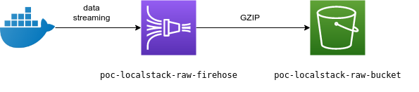

# POC with localstack

## 🌪 🌧 🌩

This project is a proof of concept using localstack as a mock AWS (cloud) to build a basic data ingestion infra using Terraform.

## Topology

This infra is intended to create a Firehose delivery stream connected to an S3 bucket.

An external application will put records to Firehose and the S3 bucket will receive buffered and gzipped objects.

&nbsp;



## Execution

Run localstack.

```sh
$ docker-compose up -d
```

Create the infra.

```sh
# go to this folder
$ cd terraform/

# build it
$ terraform init
$ terraform plan
$ terraform apply
```

## License

📖&nbsp; [MIT](./LICENSE)
